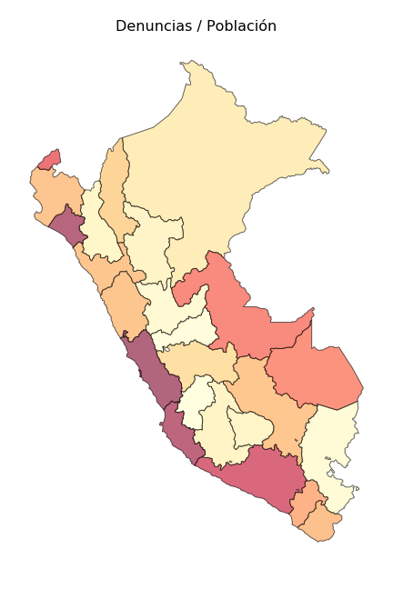
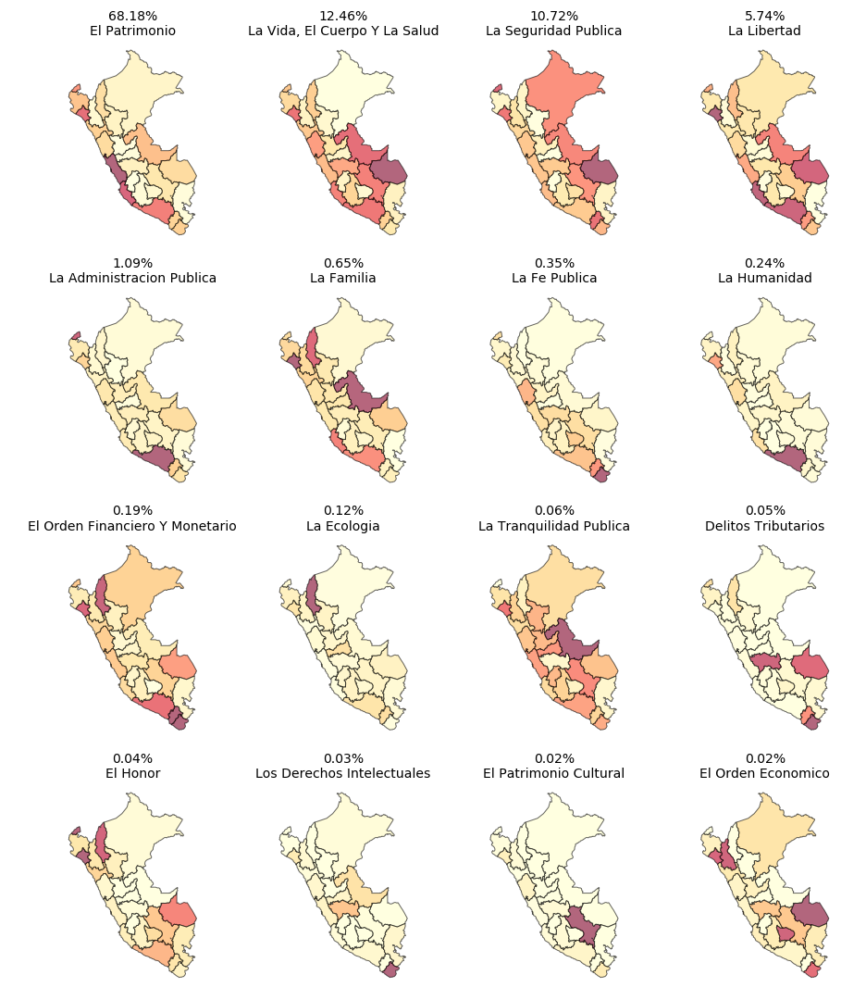

import AltairPlot from '../altairPlot/AltairPlot.js';
import data1 from './data1.js';
import data2 from './data2.js';

In Perú, the Instituto Nacional de Estadística e Informática ([INEN](https://www.inei.gob.pe/)) is the government agency in charge of statistical information. In this post, we will be looking at crime data from <http://criminalidad.inei.gob.pe>.

We can download the number of crime complaints by type and region. As we would like to compare different regions it's important to express the numbers as a population ratio rather than absolute counts. We can find the population by region on [INEI series](http://webapp.inei.gob.pe:8080/sirtod-series).

Here is a view of the numbers and ratio of complaints by region and type:

<AltairPlot data={data1} id={'data1'} />

 

## Region similarities

Now let's use some dimensionality reduction like PCA to see how similar are the different regions by crime types.

<AltairPlot data={data2} id={'data2'} />

- The X axis is showing the first component, which explains 95% of the variation.
- The size indicates population.

 

## Maps

Now, using geopandas and matplotlib, we can plot some maps. Here we have the crime complaints / population by region:

 

Finally we can show maps for the most recurrent crimes types:

 

## Code used in the post

You can find the python code here: [Notebook](https://nbviewer.jupyter.org/github/renato145/peru-stats/blob/master/nbs/explore-delitos.ipynb).
