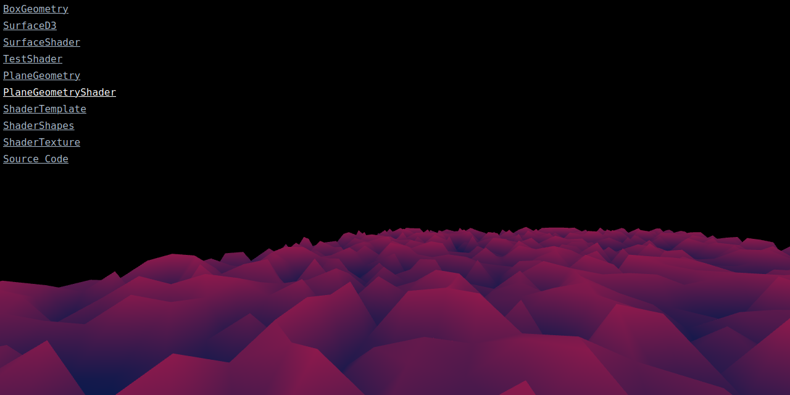

On the last few months I started playing with [threejs](https://threejs.org/) and shaders.
There is lots of things to learn on this regards so I built a small site where I will place some doodles from time to time:
[Threejs Playground](https://renato145.github.io/threejs_playground/).

If you start looking into [threejs](https://threejs.org/), it may look intimidating at the beginning (same thing with shaders),
but there are nice resources around like
[threejsfundamentals](https://threejsfundamentals.org/) and [discoverthreejs](https://discoverthreejs.com/).
Also, the [documentation](https://threejs.org/docs/) and [examples](https://threejs.org/examples/) web sites are very helpful.
And, if you already know [React](https://reactjs.org/), be sure to check [react-three-fiber](https://github.com/react-spring/react-three-fiber),
it simplifies a lot of the work.
