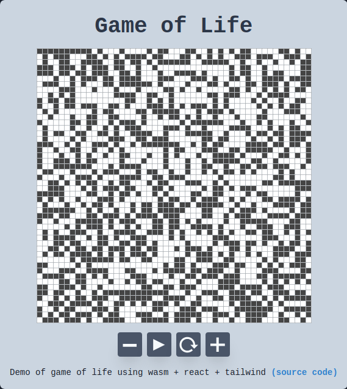

In order to improve my programming skills I decided to learn a new language,
I choosed Rust because the promise of safety and speed were very appealing.
Also, after having use many object oriented languages, I would gain more by using a different approach.

It's not an easy language to get started with, many things are different than what I'm used to, but once you get familiar it feels very elegant
(now I'm missing pattern matching whenever I write python or javascript).
For such a daunting task the best entry point is without a doubt [The Rust Programming Language](https://doc.rust-lang.org/stable/book/title-page.html).
If you want to learn Rust I really recommend to check this [twitter thread](https://twitter.com/AndreaPessino/status/1042120425415700480).

Now getting into [WebAssembly](https://webassembly.org/), there is also a good entry material:
[The Rust and WebAssembly Book](https://rustwasm.github.io/docs/book/).
Most of the book goes with a tutorial on how to implement [Conway's Game of Life](https://en.wikipedia.org/wiki/Conway%27s_Game_of_Life).
After completing the tutorial I wanted to make some modifications on it, basically trying to implement the javascript part using
[React](https://reactjs.org/) and style it with [Tailwind](https://tailwindcss.com/). So I ended doing 2 git repos:
- https://github.com/renato145/wasm_template : A template for future projects using wasm+react+tailwind.
- https://github.com/renato145/game-of-life : My final implementation of the Game of Life.

You can check the final result [here](https://renato145.github.io/game-of-life/):

